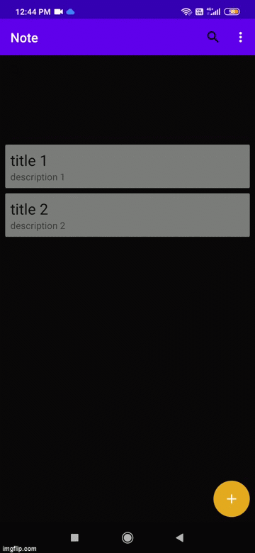
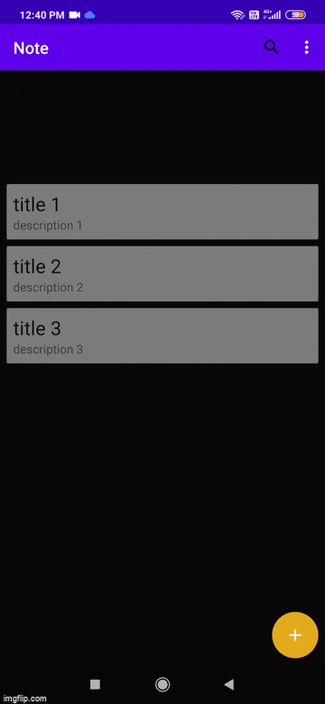

# Take Notes
## A simple note taking android application using android Room library.
# INTRODUCTION
Room is a part of android framework to enhance the database integration with the support of android component to follow the best practices for database oriented apps. Room architecture can be defined as
## Room Architecture

## RoomDemo demonstrates the CRUD operations:

* Retrieve data and display using Recycler View

* Update Note 

 * Search for Note
 
 
 * Delete Note records from database
 
 
 
 
